<div align="center">

# Hi — I’m Andres Henriquez (HC-ONLINE)

<p align="center">
  
</p>

### Software Engineer — Backend, Security & AI Infrastructure

<p>
  <strong>Backend</strong> ·
  <strong>Security</strong> ·
  <strong>AI Infrastructure</strong> ·
  <strong>Frontend Engineering</strong>
</p>

<p>
  <a href="https://github.com/HC-ONLINE">
    
  </a>
  <a href="https://hc-online.github.io/es/">
    
  </a>
</p>

</div>

---

<div align="center">

> I build backend systems, security-oriented tools, AI infrastructure, and modern web experiences.

</div>

My primary focus is **Python and Java backend development**, with a strong interest in **application security, IAM, web security, data security, and LLM infrastructure**.

I also build frontend experiences using **Astro, TypeScript, and Tailwind CSS**, with particular interest in frontend architecture, design systems, responsive interfaces, and interactive web experiences.

My projects tend to explore practical engineering problems around system architecture, security boundaries, resilience, automation, and maintainability.

---

# Areas of Focus

<table width="100%">
<tr>
<td width="50%" valign="top">

<h3>Backend Engineering</h3>

<ul>
<li>Python</li>
<li>FastAPI</li>
<li>Java</li>
<li>Spring Boot</li>
<li>Spring Security</li>
<li>REST APIs</li>
<li>API architecture</li>
<li>Authentication and authorization</li>
<li>Docker</li>
<li>Redis</li>
<li>Observability</li>
</ul>

</td>

<td width="50%" valign="top">

<h3>Security</h3>

<ul>
<li>Web application security</li>
<li>Security assessment</li>
<li>Technology fingerprinting</li>
<li>Vulnerability intelligence</li>
<li>CVE analysis</li>
<li>PII detection and data exposure</li>
<li>IAM</li>
<li>JWT</li>
<li>RBAC</li>
<li>Security testing</li>
<li>API security</li>
</ul>

</td>
</tr>

<tr>
<td width="50%" valign="top">

<h3>AI Infrastructure</h3>

<ul>
<li>LLM provider abstraction</li>
<li>Multi-provider orchestration</li>
<li>Streaming</li>
<li>Automatic fallback</li>
<li>Rate limiting</li>
<li>Resilience patterns</li>
<li>Provider adapters</li>
<li>Observability</li>
</ul>

</td>

<td width="50%" valign="top">

<h3>Frontend Engineering</h3>

<ul>
<li>Astro</li>
<li>TypeScript</li>
<li>Tailwind CSS</li>
<li>HTML/CSS</li>
<li>Design systems</li>
<li>Design tokens</li>
<li>Responsive interfaces</li>
<li>Interactive web experiences</li>
<li>Frontend architecture</li>
</ul>

</td>
</tr>
</table>
---

# Featured Projects

## CiberWebScan

### Web Security Assessment & Reconnaissance

<p>
  
  
  
</p>

A Python security toolkit for web application assessment that combines reconnaissance, technology fingerprinting, security analysis, vulnerability intelligence, web scraping, and controlled security testing.

**Key capabilities include:**

* Technology fingerprinting
* SSL/TLS analysis
* Security headers assessment
* CVE correlation
* Static and dynamic web scraping
* XSS testing
* SQL injection analysis
* Directory enumeration
* Path traversal testing
* Subdomain enumeration
* Command injection testing
* REST API
* CLI automation
* JSON, CSV, JSONL, and HTML exports

CiberWebScan is an active project and represents my main work around **web security automation and attack-surface analysis**.

<p>
<a href="https://github.com/HC-ONLINE/CiberWebScan">

</a>
</p>

---

## ModelRouter

### Multi-Provider LLM Gateway — Proof of Concept

<p>
  
  
  
</p>

An asynchronous HTTP API designed to abstract multiple LLM providers behind a single interface.

The project currently explores integrations with:

* Groq
* OpenRouter
* OpenAI
* Gemini
* Ollama

Its architecture focuses on infrastructure concerns such as:

* Automatic provider fallback
* Server-Sent Events streaming
* Rate limiting
* Temporary provider blocklisting
* Exponential backoff
* Prometheus metrics
* Structured logging
* Redis integration
* Docker deployment

ModelRouter is a **proof of concept** exploring provider-agnostic LLM infrastructure, resilience, and observability.

<p>
<a href="https://github.com/HC-ONLINE/ModelRouter">

</a>
</p>

---

## LexGuard

### PII Detection & Risk Correlation — Completed Proof of Concept

<p>
  
  
  
</p>

A completed proof of concept for deterministic detection of Personally Identifiable Information and contextual risk analysis in files and repositories.

The project explores data exposure from a security perspective using techniques such as:

* Pattern detection
* Prefix and length validation
* Luhn validation
* Entropy analysis
* Contextual validation
* Cross-PII correlation
* Explainable risk classification

**Current detection covers:**

* Colombian identification numbers
* Colombian mobile numbers
* Email addresses
* Credit card numbers

LexGuard is **no longer under active development**. It remains public as a reference implementation for CLI architecture, deterministic PII detection, and explainable risk analysis.

<p>
<a href="https://github.com/HC-ONLINE/LexGuard">

</a>
</p>

---

## DemoFactory

### Frontend Architecture & Web Experience Laboratory

<p>
  
  
  
  
</p>

A shared Astro-based environment for building and presenting multiple independent web experiences from a single project.

Each demo can maintain its own:

* Components
* Visual identity
* Content
* Types
* Interaction logic
* Data and helpers

while the platform provides common infrastructure for routing, internationalization, layouts, metadata, and shared styling.

**The collection includes experiences such as:**

| Experience               | Description                            |
| ------------------------ | -------------------------------------- |
| **Elite Vows**           | Premium editorial wedding invitation   |
| **Lumina**               | Cinematic visual-art portfolio         |
| **TechNexus Consulting** | B2B corporate landing page             |
| **Aeterna**              | Immersive historical timeline          |
| **LyricFlow**            | Interactive music experience           |
| **TypoCraft**            | Typography-focused Markdown editor     |
| **ORBIT-UI**             | CSS-first design system                |
| **AuraWeather**          | Immersive weather interface            |
| **PixelPress**           | Gaming publication                     |
| **NF Archive**           | Immersive music discography experience |

DemoFactory represents the frontend side of my work, combining **visual design, interaction, responsive development, content architecture, and reusable frontend foundations**.

<p>
<a href="https://github.com/HC-ONLINE/DemoFactory">

</a>
<a href="https://hc-online.github.io/DemoFactory/">

</a>
</p>

---

# Other Projects

<table>
<tr>
<td width="50%" valign="top">

## AccessManager

Authentication architecture study focused on Spring Boot and Spring Security, exploring stateless JWT authentication and stateful session-based authentication.

<br>

<a href="https://github.com/HC-ONLINE/AccessManager">
View Repository →
</a>

</td>

<td width="50%" valign="top">

## PermissionManager

Authorization architecture study exploring RBAC, granular permissions, JWT-based authentication, sessions, and policy-based authorization.

<br>

<a href="https://github.com/HC-ONLINE/PermissionManager">
View Repository →
</a>

</td>
</tr>

<tr>
<td width="50%" valign="top">

## ORBIT-UI

CSS-first design system built with Astro and Tailwind CSS, focused on semantic design tokens, reusable components, accessibility, and explicit component states.

<br>

<a href="https://github.com/HC-ONLINE/ORBIT-UI">
View Repository →
</a>

</td>
<td width="50%" valign="top">

</td>
</tr>
</table>

---

# Technical Stack

## Primary

### Python

`FastAPI` · `CLI development` · `automation` · `web security tooling` · `data processing`

### Java

`Spring Boot` · `Spring Security` · `Maven` · `REST APIs` · `authentication` · `authorization`

---

## Frontend

`Astro` · `TypeScript` · `Tailwind CSS` · `HTML` · `CSS` · `Markdown/MDX`

---

## Infrastructure & Tooling

`Docker` · `Docker Compose` · `Redis` · `Prometheus` · `GitHub Actions` · `Git`

---

## Security

`Web security` · `IAM` · `JWT` · `RBAC` · `CVE analysis` · `PII detection` · `security assessment` · `API security`

---

## AI Infrastructure

`LLM orchestration` · `provider abstraction` · `streaming` · `fallback strategies` · `rate limiting` · `observability`

---

# Engineering Approach

<details>
<summary><strong>Understand the problem before introducing abstractions</strong></summary>

I prefer understanding the actual architectural problem before introducing a new pattern, framework, or abstraction.

</details>

<details>
<summary><strong>Keep security boundaries explicit</strong></summary>

Authentication, authorization, data protection, and application security should be treated as distinct concerns with explicit boundaries.

</details>

<details>
<summary><strong>Prefer reusable foundations</strong></summary>

Reusable components and infrastructure should solve an actual recurring problem rather than introduce abstraction for its own sake.

</details>

<details>
<summary><strong>Design for failure</strong></summary>

Backend and infrastructure systems should account for provider failures, rate limits, unavailable dependencies, and degraded states instead of assuming that every external service is always available.

</details>

<details>
<summary><strong>Build with maintainability in mind</strong></summary>

I value explicit behavior, modular architecture, clear interfaces, and systems that can be understood and extended without unnecessary complexity.

</details>

---

# Current Areas of Development

```text
Backend Engineering
├── Python
├── Java
└── API Architecture

Application & Web Security
├── IAM
├── Authorization
└── Security Assessment

LLM Infrastructure
├── Provider Abstraction
├── Resilience
└── Observability

Frontend Architecture
├── Astro
├── Tailwind CSS
└── Design Systems
```

* Backend engineering with Python and Java
* Application and web security
* IAM and authorization systems
* LLM infrastructure and multi-provider systems
* Resilient API architecture
* Frontend architecture with Astro and Tailwind CSS
* Design systems and reusable UI foundations

---

# Portfolio

<div align="center">

For a complete view of my projects and frontend work:

<br>

<a href="https://hc-online.github.io/es/">

</a>

</div>

---

# About This Profile

> Not every repository represents a production-ready product.

This profile intentionally distinguishes between **active projects, proofs of concept, architectural studies, and frontend experiments**.

The featured projects are selected to represent the areas I am most interested in professionally:

<div align="center">

**Backend · Security · AI Infrastructure · Frontend Engineering**

</div>

Additional experiments and completed projects remain available through the repositories and the complete portfolio.

---

<div align="center">

### HC-ONLINE

`Backend` · `Security` · `AI Infrastructure` · `Frontend`

</div>
